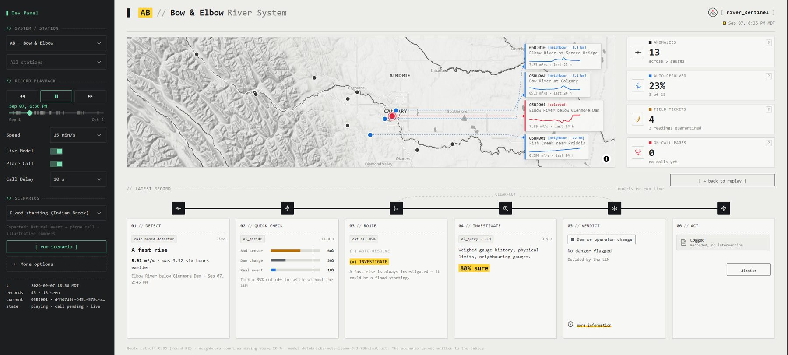
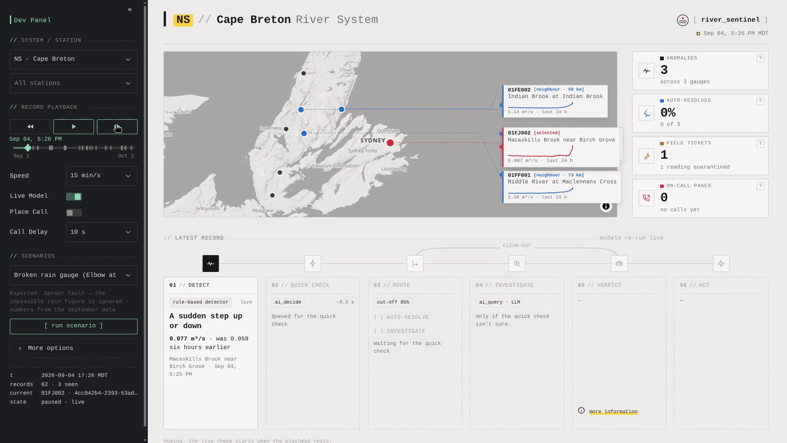
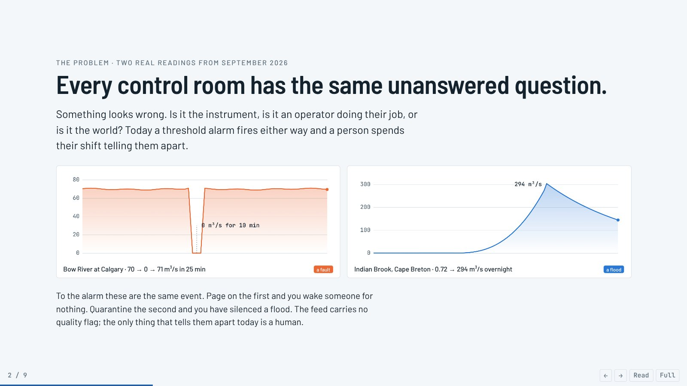
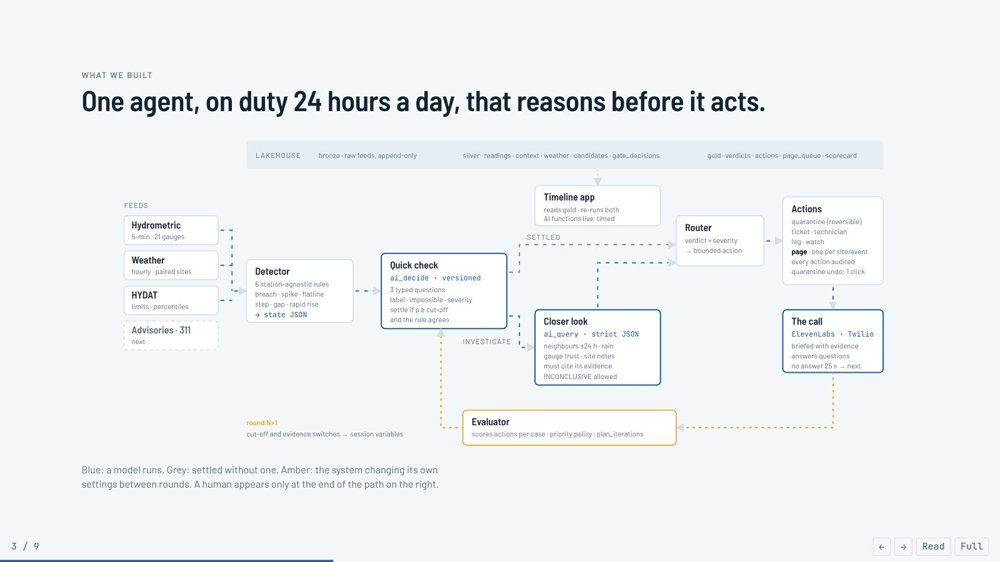
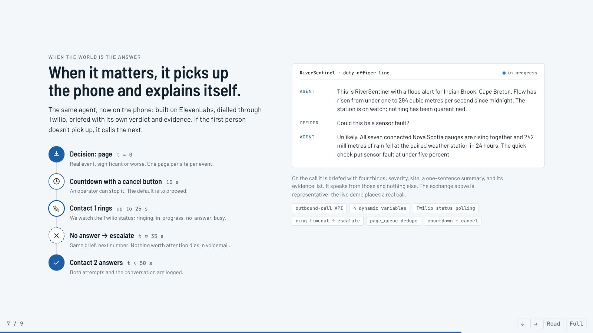

# <picture><source media="(prefers-color-scheme: dark)" srcset="docs/images/logo-dark.svg"></picture> RiverSentinel

**Sensor fault or real flood? An AI agent that tells them apart, using Environment Canada's live river data.**

🏆 **1st place, IEEE SAS YP Industry Hackathon** (Oct 2–4, 2026) · Energy & Infrastructure Systems stream

RiverSentinel watches river gauges around the clock. When a reading looks odd, it works out whether the cause is a
broken sensor, an operator's change, or a real flood. It explains its evidence, quarantines bad data automatically,
and phones the on-call officer only when a river is really rising.



**[▶ View the presentation](https://jaskaran197.github.io/RiverSentinel/story.html)** (the 9-slide story of the problem and our
solution; source in [`docs/story.html`](docs/story.html)) ·
**[Hackathon demo video](https://youtu.be/EuCOGZCm_kM)** ·
**[Recording of a real call](https://github.com/user-attachments/files/33029509/Call.Recording.m4a.mp3)** ·
**[Official submission](https://github.com/nagusubra/industry-hackathon-lab/issues/18)**

## Demo



A 55-second walkthrough, replaying September in Cape Breton with the models re-running live. A sudden step at
Macaskills Brook goes to the closer look, which calls it a minor real rise and puts the station on watch. Then River
Denys stops reporting; the agent can't rule out a real event, so it starts the countdown to call the on-call officer.

## The problem

Every control room already collects the data. What it lacks is a way to tell, in the moment, whether a strange reading
is the instrument, the operator, or the world. In one month of public hydrometric data we found both failures side by side:

- **Bow River at Calgary** reported **zero flow for ten minutes** on Sept 24: a sensor fault on the river a city drinks from.
- **Indian Brook, Cape Breton** rose **from 0.72 to 294 m³/s overnight** on Sept 4–5: a real flood that looks exactly like a glitch.

To a threshold alarm these are the same event. Page on the first and you wake someone for nothing; quarantine the
second and you have silenced a flood. The real-time feed is published as *provisional* with no quality flag. Today the
only thing that tells them apart is a person, on every alarm, every shift.



## What we built

One agent, on duty 24 hours a day, that reasons before it acts.



1. **Detect.** Six station-agnostic rules (breach, spike, flatline, step, gap, rapid rise) flag candidate anomalies in
   5-minute readings from 21 gauges.
2. **Quick check.** One Databricks [`ai_decide`](https://docs.databricks.com/aws/en/sql/language-manual/functions/ai_decide)
   call per anomaly asks three typed questions: *fault, operational change or natural event?*, *is this physically
   impossible?*, and *how severe, 1–5?*. The case is settled only if the top probability clears a cut-off **and** agrees
   with the detector rule.
3. **Closer look.** Anything unsettled goes to Llama 3.3 70B via
   [`ai_query`](https://docs.databricks.com/aws/en/sql/language-manual/functions/ai_query) with a strict JSON schema
   (verdict, severity, evidence, rationale), given neighbouring gauges over ±24 h, rainfall, gauge trust and site notes.
   `INCONCLUSIVE` is a legal answer.
4. **Act, within bounds.** Quarantine the readings (a reversible flag), open a technician ticket, log, watch, or page.
   One page per station per event.
5. **The call.** The agent phones the on-call officer through [ElevenLabs Agents](https://elevenlabs.io/docs/agents-platform/phone-numbers/twilio-integration/native-integration)
   over Twilio. It is briefed with severity, station, a summary and its evidence, and it answers questions. If no one
   answers within the ring timeout, it calls the next contact.
6. **Improve.** An evaluator scores the *actions* per case, writes one change and its reason, and the next round re-runs
   with it. Round 1 missed one case (a telemetry gap just under the 0.90 cut-off); the evaluator lowered it to 0.85 and
   round 2 scored 8/8.

### Results, September 2026 (round R2)

| | |
|---|---|
| Readings watched | **364,239** (21 gauges, 32 days, Alberta and Nova Scotia) |
| Alerts raised | **105** |
| Resolved without a phone call | **76 (72%)** |
| Bad readings quarantined | **318** |
| Technician tickets | **24** |
| Calls to a person | **22**, across 9 stations, every one a rising river |
| Faults that paged someone | **0** |
| Floods that were quarantined | **0** |
| Labelled cases correct | threshold alarm **2/8** · RiverSentinel **8/8** |

### When it matters, it picks up the phone



### Nothing about this is about rivers

Every site-specific fact lives in one configuration row (`station_context`). The stages, the two AI functions, the
actions and the phone call never change, and Cape Breton runs through the identical code path as the Bow. The same agent
could watch pipeline pressure, a processing plant or a wind farm: deploying it somewhere new is adding a row.

## What we learned

- **Probabilities beat labels for routing.** `ai_decide` returns a probability per answer, so we could set a cut-off
  *and* require agreement with the detector rule before settling a case automatically. The cut-off became a tunable the
  agent could move itself.
- **Reasoning has to be audited, not read.** We store the exact state the LLM saw next to its answer and flag any
  rationale that cites evidence it was not given (`cited_hidden_evidence`). In round 1 the model "mentioned rain" on a
  case where rain was switched off; that column is how we caught it.
- **The calls you don't make are the product.** On a real month the agent resolved 72% of alerts without a phone
  ringing, and every one of its 22 calls was a rising river.
- **Scale is a configuration row.** Cape Breton ran through the identical SQL as the Bow with no station-specific code.

## This repository

This repo holds the **demo app**: a Streamlit dashboard that replays September 2026 from the pipeline's tables, re-runs
both AI functions live on the Databricks SQL warehouse for each decision (with the real latency on screen), and places
the phone call.

The **data pipeline** (bronze → silver → gold medallion tables, all SQL on Databricks) is not part of this repository.
The app reads its output from Unity Catalog: `silver.readings`, `silver.station_context`, `silver.gate_decisions`,
`gold.verdicts` and `gold.actions`.

| File | What it does |
|---|---|
| [`app.py`](app.py) | The Streamlit app: system map, summary cards, the six-stage process flow, and the Dev Panel (sidebar) for playback and scenarios |
| [`logic.py`](logic.py) | Decision rules (routing, verdict, severity, action) mirroring the SQL pipeline, free of Streamlit so they can be unit-tested |
| [`page.py`](page.py) | The voice page: ElevenLabs agent over Twilio, with escalation on no answer (standard library only) |
| [`system_map.py`](system_map.py) | MapLibre map component: monochrome basemap with hillshade, the current station and its neighbours |
| [`player.py`](player.py) | Playback controls and seek bar for the Dev Panel |
| [`scenarios.py`](scenarios.py) | Preset events (sensor dropout, dam release, flood starting, …) to run through the agent on demand |
| [`test_databricks.py`](test_databricks.py), [`test_twilio.py`](test_twilio.py) | Manual go/no-go checks for the warehouse and phone credentials |
| [`tests/`](tests) | Offline unit tests (network access is blocked) |
| [`docs/`](docs) | The presentation, the demo video, and the images used in this README |

### Running it

You need Python 3.10+ and a Databricks workspace containing the RiverSentinel tables (see above). Phone calls are
optional: without ElevenLabs and Twilio settings, the app simulates them.

```bash
pip install -r requirements.txt
cp .env.example .env        # then fill in your Databricks host, warehouse path and token
python test_databricks.py   # checks the connection, the tables, and one live ai_decide / ai_query call
streamlit run app.py
```

In the Dev Panel, press play to replay September, or pick a scenario and press **run scenario** to watch the agent decide
in real time. **Live Model** re-runs the AI on each record instead of showing stored results. **Place Call** is off by
default; switch it on only if you want a real phone to ring when a decision reaches a page.

For development: `pip install pytest ruff`, then `pytest -q` and `ruff check .`.

## Built with

[Databricks](https://www.databricks.com/learn/free-edition) (Free Edition, Delta Lake, SQL warehouse, `ai_decide`, `ai_query`) ·
[Meta Llama 3.3 70B Instruct](https://huggingface.co/meta-llama/Llama-3.3-70B-Instruct) via Databricks Foundation Model APIs ·
[ElevenLabs Agents](https://elevenlabs.io) · [Twilio Programmable Voice](https://www.twilio.com/docs/voice) ·
[Streamlit](https://streamlit.io) · [MapLibre GL JS](https://maplibre.org)

## Data sources

All data is public, from Environment and Climate Change Canada (ECCC), for 21 gauges in Alberta (Bow and Elbow rivers)
and Nova Scotia (Cape Breton), Sept 1 – Oct 2, 2026:

- [Hydrometric Data – Real-time](https://api.weather.gc.ca/collections/hydrometric-realtime) (5-minute water level and discharge)
- [Hydrometric Data – Daily Mean](https://api.weather.gc.ca/collections/hydrometric-daily-mean) and the
  [HYDAT database](https://wateroffice.ec.gc.ca/mainmenu/historical_data_index_e.html) (physical limits and monthly percentiles)
- [Hydrometric Stations](https://api.weather.gc.ca/collections/hydrometric-stations)
- [Climate – Hourly](https://api.weather.gc.ca/collections/climate-hourly) (precipitation, temperature)

Contains information licensed under the [Open Government Licence – Canada](https://open.canada.ca/en/open-government-licence-canada).
Map data © [OpenStreetMap](https://www.openstreetmap.org/copyright) contributors, served by [OpenFreeMap](https://openfreemap.org)
using the [OpenMapTiles](https://openmaptiles.org) schema; hillshade from [AWS Terrain Tiles](https://registry.opendata.aws/terrain-tiles/).

## Team

**not2sureyet**, Calgary

- **Jaskaran Bhogal** ([@Jaskaran197](https://github.com/Jaskaran197)), Data Scientist
- **Steve Dempster** ([@code-spd](https://github.com/code-spd)), Operational Analyst / Data Engineer
